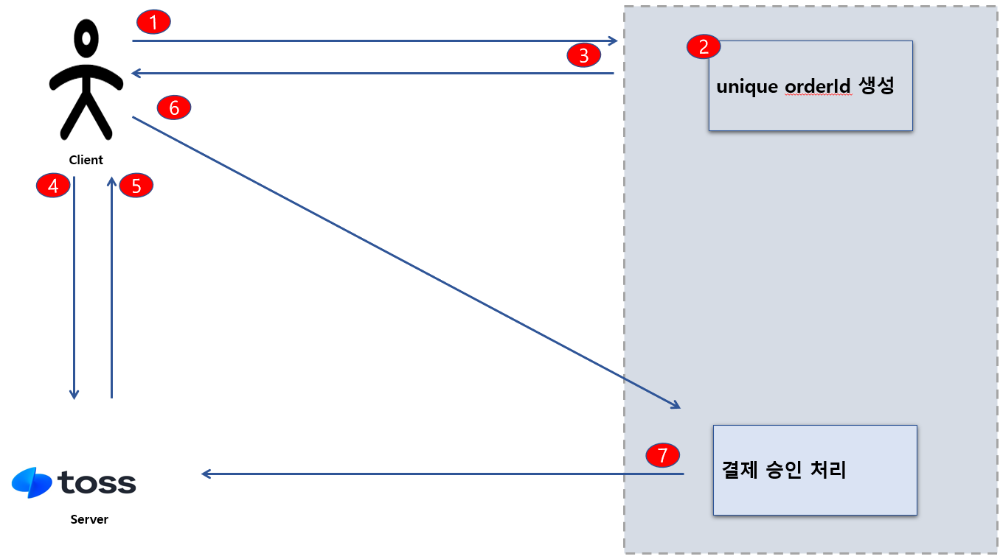

# Payment Testing 구현

자세한 설명은 

https://syh8088.github.io/2024/12/02/JAVA/TEST/PaymentTesting/PaymentTesting1
https://syh8088.github.io/2024/12/03/JAVA/TEST/PaymentTesting/PaymentTesting2

에서 정리 되어 있습니다. 참고 부탁드립니다.

### Skill & Tools

---

#### Backend

- Java 17
- Spring boot 3.2.0
- Junit5
- JPA
- QueryDsl
- Mysql 8.x

#### 결제 프로세스 설명


간단하게 TEST 대상이 되는 결제 시스템에 대해 설명 하도록 하겠습니다.

1. 우선 사용자가 결제 버튼을 클릭하면 'Checkout' 이벤트가 발생되면서 사용자가 특정 상품에 대한 구매 이벤트를 발생 하도록 합니다.
2. 'Checkout' 이벤트가 발생되면서 서비스단에서는 PaymentEvent 가 생성되고 더불어 해당 이벤트에 대한 unique id 값을 생성 하도록 합니다.


3. 특정 결제 unique id 값 포함해서 상품 가격 데이터를 Toss 서버에 전달 하게 되고 이에 응답으로 Toss 에서 제공하는 결제 위젯 페이지를 띄우게 됩니다.
4. 사용자가 Toss 에서 제공하는 위젯페이지 통해 실질적으로 결제가 진행 됩니다.
5. 결제가 진행되고 Toss 는 사용자에게 결제 결과 응답을 해줍니다.
6. 응답과 동시에 결제 서비스 서버로 Redirect 발생됩니다.
7. 최종적으로 결제 승인을 처리 하기 위해 사용자가 구매한 결제를 최종적으로 성공 했다는 사실을 Toss 서버에 전달 합니다. 성공시 최종적으로 결제가 완료 됩니다. 동시에 결제 상태 업데이트를 하게 됩니다.

#### DB 초기 셋팅
```mysql
create schema payment_testing;

create table payment_testing.members
(
    no         bigint auto_increment
        primary key,
    name       varchar(50)                        not null,
    created_at datetime default CURRENT_TIMESTAMP not null,
    updated_at datetime default CURRENT_TIMESTAMP not null
);

create table payment_testing.payment_events
(
    no              bigint auto_increment
        primary key,
    member_no       bigint                               null,
    is_payment_done tinyint(1) default 0                 not null,
    payment_key     varchar(255)                         null,
    order_id        varchar(255)                         null,
    type            enum ('NORMAL')                      not null,
    order_name      varchar(255)                         null,
    method          enum ('CARD')                        null,
    psp_raw_data    text                                 null,
    approved_at     datetime                             null,
    created_at      datetime   default CURRENT_TIMESTAMP not null,
    updated_at      datetime   default CURRENT_TIMESTAMP not null,
    constraint order_id
        unique (order_id),
    constraint payment_key
        unique (payment_key)
);

create table payment_testing.payment_orders
(
    no                   bigint auto_increment
        primary key,
    payment_event_no     bigint                                                                                       not null,
    product_no           bigint                                                                                       not null,
    order_id             varchar(255)                                                                                 not null,
    amount               decimal(12, 2)                                                                               not null,
    payment_order_status enum ('NOT_STARTED', 'EXECUTING', 'SUCCESS', 'FAILURE', 'UNKNOWN') default 'NOT_STARTED'     not null,
    failed_count         tinyint                                                            default 0                 not null,
    threshold            tinyint                                                            default 5                 not null,
    created_at           datetime                                                           default CURRENT_TIMESTAMP not null,
    updated_at           datetime                                                           default CURRENT_TIMESTAMP not null
);

create table payment_testing.payment_order_histories
(
    no               bigint auto_increment
        primary key,
    payment_order_no bigint                                                             not null,
    previous_status  enum ('NOT_STARTED', 'EXECUTING', 'SUCCESS', 'FAILURE', 'UNKNOWN') null,
    new_status       enum ('NOT_STARTED', 'EXECUTING', 'SUCCESS', 'FAILURE', 'UNKNOWN') null,
    created_at       datetime default CURRENT_TIMESTAMP                                 not null,
    updated_at       datetime default CURRENT_TIMESTAMP                                 not null,
    changed_by       varchar(255)                                                       null,
    reason           varchar(255)                                                       null
);

create table payment_testing.products
(
    no         bigint auto_increment
        primary key,
    product_id varchar(255)                       not null,
    name       varchar(50)                        not null,
    price      decimal(12, 2)                     not null,
    created_at datetime default CURRENT_TIMESTAMP not null,
    updated_at datetime default CURRENT_TIMESTAMP not null
);


INSERT INTO payment_testing.products (no, product_id, name, price, created_at, updated_at) VALUES (1, 'A', '상품A', 1000.00, '2024-11-28 22:55:09', '2024-11-28 22:55:09');
INSERT INTO payment_testing.products (no, product_id, name, price, created_at, updated_at) VALUES (2, 'B', '상품B', 2000.00, '2024-11-28 22:55:09', '2024-11-28 22:55:09');
INSERT INTO payment_testing.products (no, product_id, name, price, created_at, updated_at) VALUES (3, 'C', '상품C', 3000.00, '2024-11-28 22:55:09', '2024-11-28 22:55:09');
```