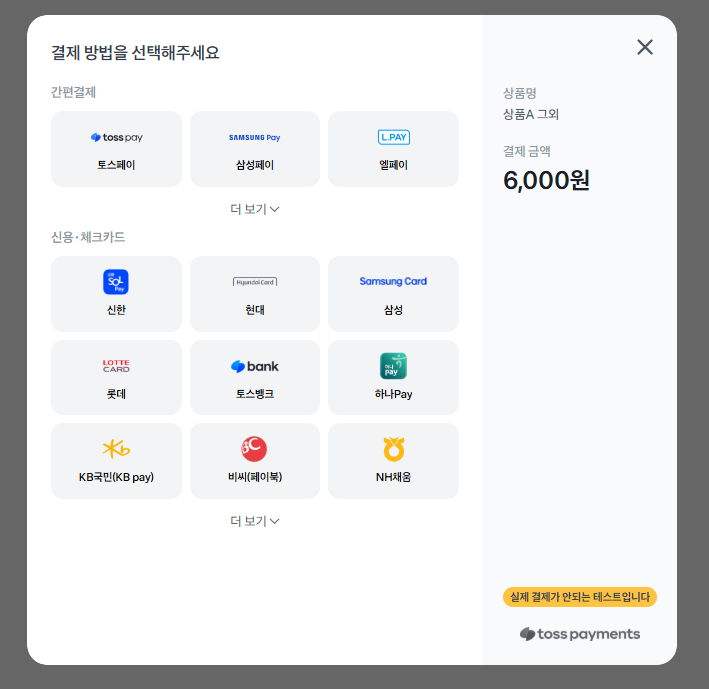

# Payment Testing 구현

자세한 설명은 

https://syh8088.github.io/2024/12/02/JAVA/TEST/PaymentTesting/PaymentTesting1
https://syh8088.github.io/2024/12/02/JAVA/TEST/PaymentTesting/PaymentTesting2

에서 정리 되어 있습니다. 참고 부탁드립니다.

### Skill & Tools

---

#### Backend

- Java 17
- Spring boot 3.2.0
- Junit
- JPA
- Mysql 8.x

#### 결제 프로세스 설명

간단하게 TEST 대상이 되는 결제 시스템에 대해 설명 하도록 하겠습니다.

1. 우선 사용자가 결제 버튼을 클릭하면 'Checkout' 이벤트가 발생되면서 사용자가 특정 상품에 대한 구매 이벤트를 발생 하도록 합니다.
2. 'Checkout' 이벤트가 발생되면서 서비스단에서는 PaymentEvent 가 생성되고 더불어 해당 이벤트에 대한 unique id 값을 생성 하도록 합니다.

3. 특정 결제 unique id 값 포함해서 상품 가격 데이터를 Toss 서버에 전달 하게 되고 이에 응답으로 Toss 에서 제공하는 결제 위젯 페이지를 띄우게 됩니다.
4. 사용자가 Toss 에서 제공하는 위젯페이지 통해 실질적으로 결제가 진행 됩니다.
5. 결제가 진행되고 Toss 는 사용자에게 결제 결과 응답을 해줍니다.
6. 응답과 동시에 결제 서비스 서버로 Redirect 발생됩니다.
7. 최종적으로 결제 승인을 처리 하기 위해 사용자가 구매한 결제를 최종적으로 성공 했다는 사실을 Toss 서버에 전달 합니다. 성공시 최종적으로 결제가 완료 됩니다. 동시에 결제 상태 업데이트를 하게 됩니다.

